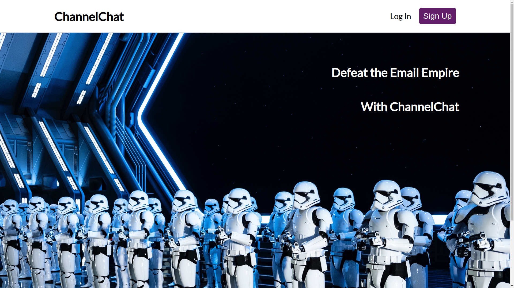
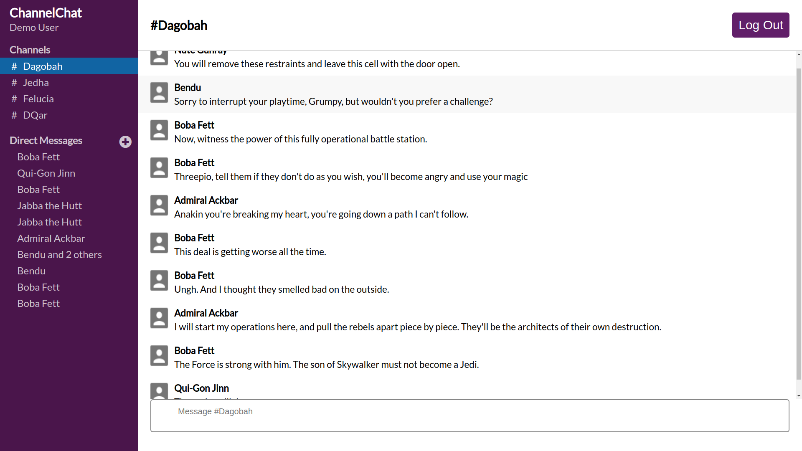
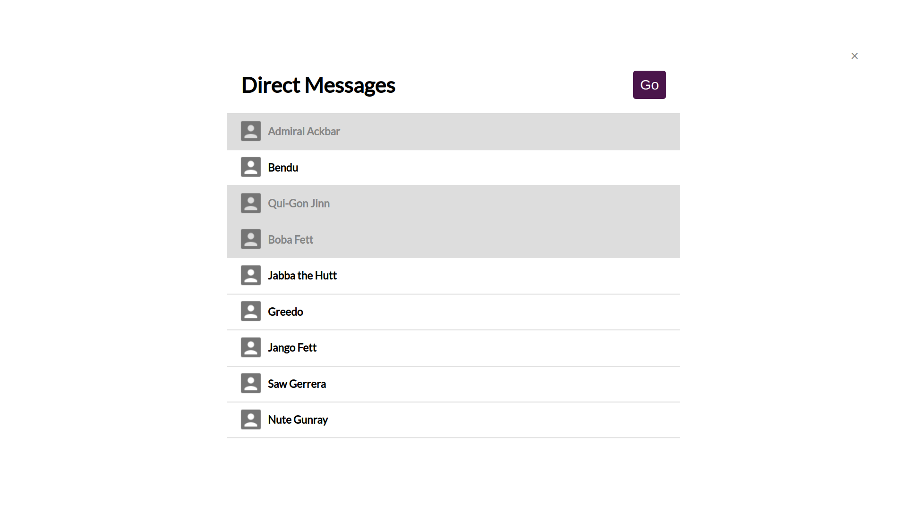

# ChannelChat

Welcome to ChannelChat - my clone of Slack. This web app provides the core
functionality of the original by allowing users post and receive messages in 
channels, and to send and receive direct messages to and from other users or 
groups of users.

[Live Site](https://channel-chat-heroku.herokuapp.com)



This single-page app uses a React-Redux frontend that communicates with a Ruby 
on Rails backend via JQuery ajax requests. 



In order for messages to be pushed to their recipients in real time, I 
had to go above and beyond http and the request / response lifecycle by 
implementing websockets using the Rails ActionCable framework.

React components on the frontend subscribe to ActionCable Channels on the 
backend at streams that are associated with particular Rails ActiveRecord 
Models. For instance, the following code initiates a subscription to receive
messages:

```javascript
 App.cable.subscriptions.create(
  {
    channel: "MessagesChannel",
    channelId: this.props.match.params.channelId
  },
  {
    received: message => {
      this.props.receiveMessage(message);
    }
  }
);
);
```

and following code in the Rails backend receives and create the subscription
from above:

```Ruby
def subscribed
  channel = Channel.find(params[:channel_id])
  stream_for channel
end
```

Finally, when a message is created, it is broadcasted live using the following 
code:

```Ruby
MessagesChannel.broadcast_to( 
  channel, 
  message: message_hash,
  author: user_hash
)
```

Direct Messages are slightly more challenging. 



Here, the creation of a Direct
Message conversation must be broadcast to all the members of the conversation.
I achieved this by broadcasting the creation of new conversations at multiple
streams, one stream for each member of the conversation, as follows:

```Ruby
channel.members.each do |member|
  channel_hash[:title] = channel.generate_direct_chat_title(member)
  ChannelsChannel.broadcast_to(
    member,
    members: members_hash,
    channel: channel_hash
  )
end
```
Additionally, the title of each Direct Message conversation must be generated
dynamically based on the current user. I did this using the following code:

```Ruby
def generate_direct_chat_title(current_member)
    other_members = self.members.reject { |member| member == current_member }
    
    if other_members.length == 1
      other_members.first.username
    elsif other_members.length == 2
      "#{other_members.first.username} and 1 other"
    else
      number_to_display = other_members.length - 1
      "#{other_members.first.username} and #{number_to_display} others"
    end
  end
```

## Technologies

+ Javascript
+ Ruby on Rails
+ PostgreSQL
+ HTML
+ SCSS/CSS

## Frameworks
+ React.js (including react-router-dom)
+ Redux (including react-redux and redux-thunk middleware)
+ jQuery for Ajax calls to my Rails API
+ ActionCable - Rails websockets Framework
+ JBuilder for generating json responses to API requests
+ Bcrypt for user authorization
+ Heroku for hosting the production website
